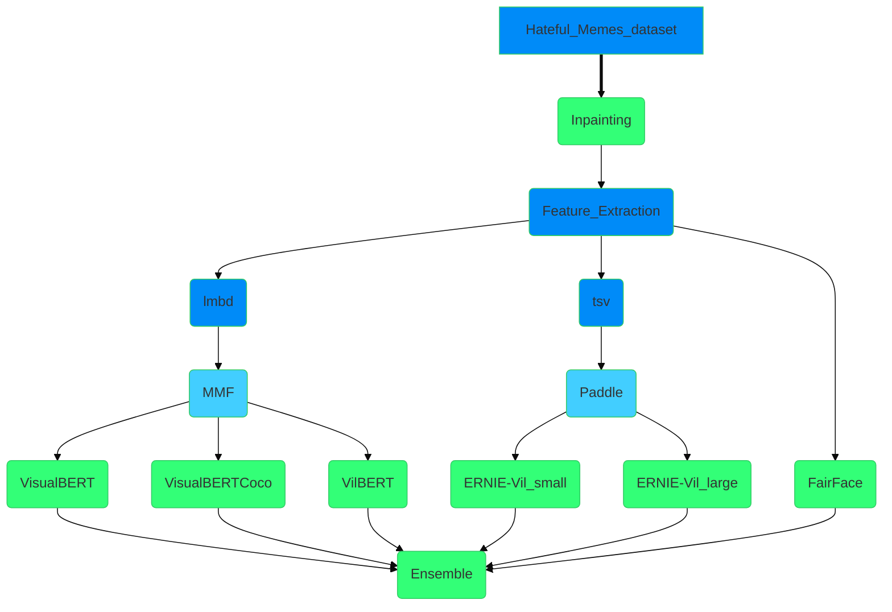

# First approach HM competition

This repsository content all the code needed to reproduce que approach for Hateful Memes comptetition by Facebook AI. The approach follow this structure:

## 1. Inpainting the images

[notebook](https://colab.research.google.com/drive/1XBiNhKOV4uv532swUWaXcT_VatU7qGl2#scrollTo=JOlHTcZBv-2B): in order to get more information from images we try to inpainting the words and got only the image. The code is borrowed from [github](https://github.com/HimariO/mmdetection-meme.git) and [github](https://github.com/HimariO/HatefulMemesChallenge.git) both codes from HimariO.

## 2. Feature extraction 

[notebook](https://colab.research.google.com/drive/1IJt5ViL6tG205209EyGwGp435rIH_tzW): we extract features with different size of features to be used in `ERNIE-Vil` model.

## 3. Fair Face 
[noteebok](none):

## 4. Models
### 4.1. MMF (Pytorch):
#### 4.1.1 VisualBERT (small)
#### 4.1.2 VisualBERT (COCO)
#### 4.1.3 VilBERT

### 4.2 ERNIE-Vil (Paddle):
#### 4.2.1 ERNIE-Vil (small):
#### 4.2.1 ERNIE-Vil (large):

## 5. Ensemble:

## Attributions

The code heavily borrows from the following repositories, thanks for their great work:

@article{mmdetection,
  title   = {{MMDetection}: Open MMLab Detection Toolbox and Benchmark},
  author  = {Chen, Kai and Wang, Jiaqi and Pang, Jiangmiao and Cao, Yuhang and
             Xiong, Yu and Li, Xiaoxiao and Sun, Shuyang and Feng, Wansen and
             Liu, Ziwei and Xu, Jiarui and Zhang, Zheng and Cheng, Dazhi and
             Zhu, Chenchen and Cheng, Tianheng and Zhao, Qijie and Li, Buyu and
             Lu, Xin and Zhu, Rui and Wu, Yue and Dai, Jifeng and Wang, Jingdong
             and Shi, Jianping and Ouyang, Wanli and Loy, Chen Change and Lin, Dahua},
  journal= {arXiv preprint arXiv:1906.07155},
  year={2019}
}

@misc{singh2020mmf,
  author =       {Singh, Amanpreet and Goswami, Vedanuj and Natarajan, Vivek and Jiang, Yu and Chen, Xinlei and Shah, Meet and
                 Rohrbach, Marcus and Batra, Dhruv and Parikh, Devi},
  title =        {MMF: A multimodal framework for vision and language research},
  howpublished = {\url{https://github.com/facebookresearch/mmf}},
  year =         {2020}
}

@article{yu2020ernie,
  title={Ernie-vil: Knowledge enhanced vision-language representations through scene graph},
  author={Yu, Fei and Tang, Jiji and Yin, Weichong and Sun, Yu and Tian, Hao and Wu, Hua and Wang, Haifeng},
  journal={arXiv preprint arXiv:2006.16934},
  year={2020}
}

https://github.com/Muennighoff/vilio
