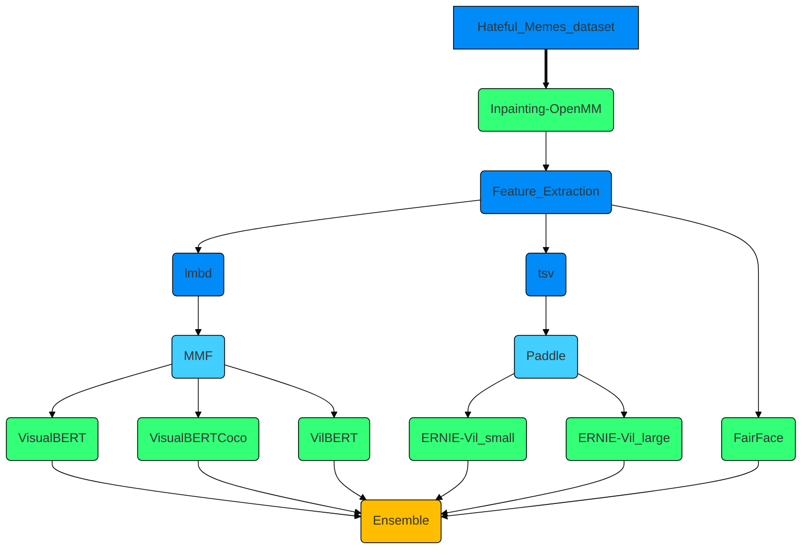

# Hateful Memes Competition By Facebook AI

This repsository content all the code needed to reproduce approach for Hateful Memes challange. Dispite the competition is close I decide to do my MSc final thesis about this challange. You can reproduce the work using this repository and following the steps detailed in each README and notebook.

# Table of contents

- [Inpainting the images](##-1.-Inpainting-the-image)
- [Feature extraction](##-2.-Feature-extraction)
- [FairFace](##-3.-FairFace)
- [Models](##4.-Models)
  - [mmf](###-4.1.-MMF-(Pytorch):)
    - [VisualBERT](####-4.1.1-VisualBERT-(small))
  - [ERNIE-Vil](###-4.2-ERNIE-Vil-(Paddle):)
- [Ensemble](##-5.-Ensemble:)

## 1. Inpainting the images

In this [notebook](https://colab.research.google.com/drive/1XBiNhKOV4uv532swUWaXcT_VatU7qGl2#scrollTo=JOlHTcZBv-2B) reproduce the inpainting process. In order to get more information from images we inpainting the words and got only the image. The code is borrowed from [github](https://github.com/HimariO/mmdetection-meme.git) code and fork from [HimariO](https://github.com/HimariO).

## 2. Feature extraction 

The feature extraction is did in two parts, one for the `mmf` models and the other for the `ernie-vil` models.

- In this [notebook](https://colab.research.google.com/drive/1y8RBKamXcWKSRxYTwj4vJpYl0RtXhNoy) is reproduced the features extraction using py-bottom-up-attention for `mmf` models. The output is a `.npy` objects, one for each image with 100 number of features extracted. Then the `.npy` objects are transform to `.mdb` to be used in `mmf` models.
 
- In this [notebook](https://colab.research.google.com/drive/1IJt5ViL6tG205209EyGwGp435rIH_tzW) is reproduced the features extraction using py-bottom-up-attention. Output features with different size (number of features) to be used in `ERNIE-Vil` model (`.tsv` format).

- Also, are used the `.lmbd` features gived by the competition (download link).

## 3. FairFace 

This model help us to extract features from the photos: Age, gender and race. The main feature that we are interested in is the reace, because a important part of hateful memes are racist.
To reproduce this part read the repository [README](https://github.com/JanLeyva/approach_TFM/tree/master/feature_extraction/FairFace_features) or follow the following [notebook](https://github.com/JanLeyva/approach_TFM/blob/master/feature_extraction/FairFace_features/FairFace_features.ipynb).

## 4. Models
### 4.1. MMF (Pytorch):
`MMF` is a framework based in Pytorch develope by *FacebookAI*. You can check more details in his [doc]().

#### 4.1.1 VisualBERT (small)
#### 4.1.2 VisualBERT (COCO)
#### 4.1.3 VilBERT

### 4.2 ERNIE-Vil (Paddle):
#### 4.2.1 ERNIE-Vil (small):
#### 4.2.1 ERNIE-Vil (large):

## 5. Ensemble:

The ensemble will be done in two parts:
- First a major voting: predict the class with the largest sum of votes from models.
- Second a racism classifier, the racism classifier is based on a *heuristic* where use the FairFace features and text memes in order to classify if a meme is racist or not.

## Attributions

The code heavily borrows from the following repositories, thanks for their great work:

@article{DBLP:journals/corr/abs-2012-07788,
  author    = {Niklas Muennighoff},
  title     = {Vilio: State-of-the-art Visio-Linguistic Models applied to Hateful
               Memes},
  journal   = {CoRR},
  volume    = {abs/2012.07788},
  year      = {2020},
  url       = {https://arxiv.org/abs/2012.07788},
  eprinttype = {arXiv},
  eprint    = {2012.07788},
  timestamp = {Sat, 02 Jan 2021 15:43:30 +0100},
  biburl    = {https://dblp.org/rec/journals/corr/abs-2012-07788.bib},
  bibsource = {dblp computer science bibliography, https://dblp.org}
}

* Niklas Muennighoff [github](https://github.com/Muennighoff/vilio)

@article{DBLP:journals/corr/abs-2012-08290,
  author    = {Ron Zhu},
  title     = {Enhance Multimodal Transformer With External Label And In-Domain Pretrain:
               Hateful Meme Challenge Winning Solution},
  journal   = {CoRR},
  volume    = {abs/2012.08290},
  year      = {2020},
  url       = {https://arxiv.org/abs/2012.08290},
  eprinttype = {arXiv},
  eprint    = {2012.08290},
  timestamp = {Sat, 02 Jan 2021 15:43:30 +0100},
  biburl    = {https://dblp.org/rec/journals/corr/abs-2012-08290.bib},
  bibsource = {dblp computer science bibliography, https://dblp.org}
}

* Alfred lab [github](https://github.com/HimariO/HatefulMemesChallenge)

