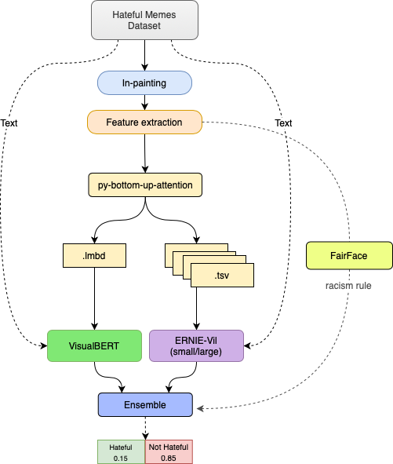

# Hateful Memes Competition By Facebook AI

This repsository content all the code needed to reproduce approach for Hateful Memes challange. Dispite the competition is close I decide to do my MSc final thesis about this challange. You can reproduce the work using this repository and following the steps detailed in each README and notebook.





# Introduction

In this REAME a schema to reproduce the results for **Hateful Memes** dataset is presented. In order to underestand and **run** the codes of each section, go to each one of the *README* folders.
The problem is solved in two phases:
  1. Image processing (sections: 1, 2, 3 and 4).
  2. Model and Classification (section 5 and 6).

## 1. Download dataset

The dataset used in this work is Hateful Memes dataset, a multi modal (text and images) dataset build in a specific way (check his [website](https://ai.facebook.com/blog/hateful-memes-challenge-and-data-set/) for more details) to use vision and language input in order to solve propertly the problem.
**The problem:** that would be solve is classify if a memes is hatefl (1) or not hateful (0). The metric used is **AUROC** (as well accuracy is provided for better underestanding) .

* Unfortunately the competition is close, but you can **download the dataset** in his [official website](https://hatefulmemeschallenge.com).

Once the dataset is download, you can store in drive and download it when you want via `wget`.

```bash
!wget --load-cookies /tmp/cookies.txt "https://docs.google.com/uc?export=download&confirm=$(wget --quiet --save-cookies /tmp/cookies.txt --keep-session-cookies --no-check-certificate 'https://docs.google.com/uc?export=download&id=HERE_YOUR_ULR_FROM_DRIVE' -O- | sed -rn 's/.*confirm=([0-9A-Za-z_]+).*/\1\n/p')&id=HERE_YOUR_ULR_FROM_DRIVE" -O hateful_memes.zip && rm -rf /tmp/cookies.txt
```

## 2. Inpainting the images

In this  reproduce the inpainting process. In order to get more information from images we inpainting the words and got only the image. The code is borrowed from  code and fork from [HimariO](https://github.com/HimariO).

## 3. Feature extraction 

The feature extraction is did in two parts, one for the `mmf` models and the other for the `ernie-vil` models.

- In this  is reproduced the features extraction using py-bottom-up-attention for `mmf` models. The output is a `.npy` objects, one for each image with 100 number of features extracted. Then the `.npy` objects are transform to `.mdb` to be used in `mmf` models.
 
- In this  is reproduced the features extraction using py-bottom-up-attention. Output features with different size (number of features) to be used in `ERNIE-Vil` model (`.tsv` format).

## 4. FairFace 

This model help us to extract features from the photos: Age, gender and race. The main feature that we are interested in is the reace, because a important part of hateful memes are racist.
To reproduce this part read the repository [README](https://github.com/JanLeyva/approach_TFM/tree/master/feature_extraction/FairFace_features) or follow the following [].

## 5. Models
### 5.1. MMF (Pytorch)
`MMF` is a framework based in Pytorch develope by *FacebookAI*. 

  #### 5.1.1 VisualBERT (COCO)


### 5.2 ERNIE-Vil (Paddle)
  #### 5.2.1 ERNIE-Vil (small)
  #### 5.2.1 ERNIE-Vil (large)

## 6. Ensemble

The ensemble will be done in two parts:
- First find the best method for ensembling the models between (simple average, rank average and optimizer).
- Second a racism classifier is applied, the racism classifier is based on a *heuristic* where use the FairFace features and text memes in order to classify if a meme is racist or not.


## Attributions

The code heavily borrows from the following repositories, thanks for their great work:

```BibTeX
@article{DBLP:journals/corr/abs-2012-07788,
  author    = {Niklas Muennighoff},
  title     = {Vilio: State-of-the-art Visio-Linguistic Models applied to Hateful
               Memes},
  journal   = {CoRR},
  volume    = {abs/2012.07788},
  year      = {2020},
  url       = {https://arxiv.org/abs/2012.07788},
  eprinttype = {arXiv},
  eprint    = {2012.07788},
  timestamp = {Sat, 02 Jan 2021 15:43:30 +0100},
  biburl    = {https://dblp.org/rec/journals/corr/abs-2012-07788.bib},
  bibsource = {dblp computer science bibliography, https://dblp.org}
}
```
* Niklas Muennighoff [github](https://github.com/Muennighoff/vilio)

```BibTeX
@article{DBLP:journals/corr/abs-2012-08290,
  author    = {Ron Zhu},
  title     = {Enhance Multimodal Transformer With External Label And In-Domain Pretrain:
               Hateful Meme Challenge Winning Solution},
  journal   = {CoRR},
  volume    = {abs/2012.08290},
  year      = {2020},
  url       = {https://arxiv.org/abs/2012.08290},
  eprinttype = {arXiv},
  eprint    = {2012.08290},
  timestamp = {Sat, 02 Jan 2021 15:43:30 +0100},
  biburl    = {https://dblp.org/rec/journals/corr/abs-2012-08290.bib},
  bibsource = {dblp computer science bibliography, https://dblp.org}
}
```
* Alfred lab [github](https://github.com/HimariO/HatefulMemesChallenge)


----------------------------------------------------
## To Do:
* add grid seach for mmf models
* add cv
* py-bottom-up-attention_mmf readme
* ERNIE-Vil readme
* inpainting_hm readme
* mmf models readme
* results!